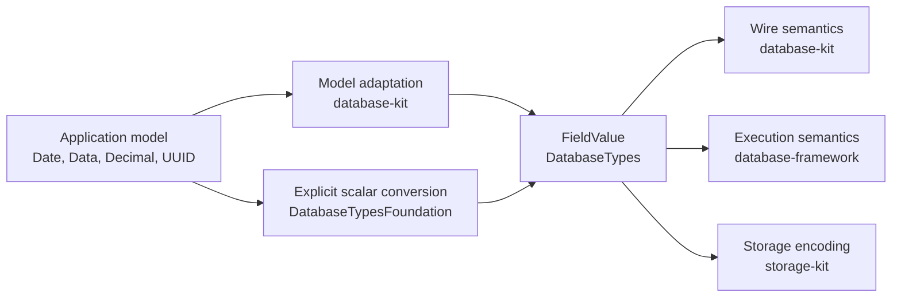
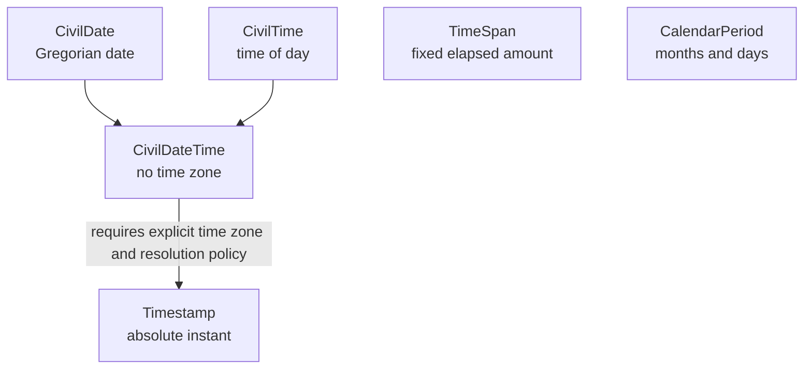

# Database Value Specification

## Status

This document defines the initial `database-types` value contract. It is the v1
design; there is no legacy protocol or compatibility representation.

## Layer boundary



`DatabaseTypes` owns primitive representation, intrinsic validation, equality,
hashing, deterministic ordering, immutable ownership, and scoped borrowing.
It does not own schema, query coercion, wire tags, persistence policy, indexes,
or runtime behavior.

`DatabaseTypesFoundation` is an optional native adapter. It owns explicit
conversion between Foundation scalar values and canonical primitives. The core
target does not import Foundation or FoundationEssentials.

Application-model conformance such as `FieldRepresentation` belongs to the
model-adaptation layer. User models are not required to expose `FieldValue`,
`CivilDate`, or `ByteString` directly.

## Canonical field algebra

`FieldValue` is a closed algebra with the following cases:

| Family | Cases |
|---|---|
| Null and boolean | `null`, `bool` |
| Signed integer | `int8`, `int16`, `int32`, `int64` |
| Unsigned integer | `uint8`, `uint16`, `uint32`, `uint64` |
| Floating point | `float32`, `float64` |
| Exact decimal | `decimal(ExactDecimal)` |
| Text and bytes | `string`, `bytes` |
| Civil time | `date`, `time`, `dateTime` |
| Absolute and relative time | `timestamp`, `timeSpan`, `calendarPeriod` |
| Specialized value | `geographicPoint`, `geographicPosition`, `vector`, `uuid` |
| Structural | `array`, `object`, `reference`, `rdfTerm` |

Numeric widths are part of value identity. `int8(1)`, `int64(1)`, and
`uint64(1)` are distinct values. Numeric coercion is a query responsibility.
Float identity preserves the IEEE bit pattern.

`FieldValue.object` contains a `FieldObject`, not a bare array.
`FieldObject` requires unique field numbers and exact field names, and stores
fields in ascending number order. Input order therefore does not affect object
identity, hashing, comparison, wire iteration, or storage encoding. Its
internal array is canonical contiguous storage rather than the public object
contract.

## User-facing and canonical types

| User-facing value | Canonical representation | Conversion contract |
|---|---|---|
| `Bool` | `Bool` | Direct |
| `Int8...Int64` | Same width | Direct |
| `UInt8...UInt64` | Same width | Direct |
| `Float`, `Double` | Same width | Direct |
| `String` | `String` | Direct |
| Foundation `Date` | `Timestamp` | Explicit nearest-even nanosecond rounding |
| Foundation `Data` | `ByteString` | Retain and borrow without payload copy |
| Foundation `UUID` | `UUID` | Exact 16-byte conversion |
| Foundation `Decimal` | `ExactDecimal` | Exact conversion or typed failure |
| Calendar date | `CivilDate` | Explicit calendar and time zone |
| Local time | `CivilTime` | No implicit UTC interpretation |
| Local date-time | `CivilDateTime` | No implicit time-zone resolution |
| Swift `Duration` | `TimeSpan` | Nearest-even nanosecond rounding |
| Foundation `DateComponents` | `CalendarPeriod` | Strict year/month/day conversion |
| Coordinates | `GeographicPoint` | Validated WGS 84 degrees |
| Three-dimensional position | `GeographicPosition` | WGS 84 ellipsoidal height in meters |
| Dense numeric vector | `Vector` | Width-preserving retained storage |

## Temporal model



`CivilDate` preserves SQL `DATE` compatibility. `CivilTime` preserves SQL
`TIME`. `CivilDateTime` represents a timestamp without time zone. None of these
values identifies an instant.

`Timestamp` is Unix-epoch seconds plus nanoseconds in
`0..<1_000_000_000`. The same floor representation applies before the epoch.

Foundation `Date` stores binary floating-point seconds and cannot preserve
nanoseconds uniformly. Conversion to `Timestamp` rounds to the nearest
nanosecond, with ties resolved to the even nanosecond. Conversion back produces
the nearest `Date` representation and does not promise a nanosecond-exact
round-trip.

`TimeSpan` is context-free elapsed time. `CalendarPeriod` stores total months
and days. They are not implicitly interchangeable because a calendar month has
no fixed number of seconds.

Swift `Duration` uses attosecond resolution. Conversion to `TimeSpan` rounds
once to the nearest nanosecond with ties resolved to even. Conversion from
`TimeSpan` to `Duration` is exact. Foundation `DateComponents` converts to
`CalendarPeriod` only when it contains year, month, and day amounts; date
position and sub-day fields are rejected rather than discarded.

## Exact decimal

`ExactDecimal` represents:

```text
coefficient × 10^(-scale)
```

- `coefficient` is `Int128`.
- `scale` is `Int32`.
- zero is always `(0, 0)`.
- trailing decimal zeros are removed from every nonzero coefficient while the
  scale can be reduced.
- values are finite; NaN and infinity have no decimal representation.
- arithmetic either returns an exact representable result or a typed failure.
- division rejects non-terminating decimal results instead of rounding
  silently.

Foundation conversion verifies an exact round-trip. Values whose normalized
coefficient does not fit signed `Int128`, including Foundation's unsigned
39-digit extreme, fail with `coefficientOutOfRange`. Values outside
Foundation's exponent range fail with `valueOutOfRange`. No conversion
saturates, truncates, or silently rounds.

## Vector and geographic point

`Vector` preserves Float32 or Float64 element width. It rejects non-finite
elements, retains copy-on-write array storage, provides scoped contiguous
borrows, and creates constant-time slices. Similarity metrics, vector
normalization, dimension limits, and ANN indexes belong to upper layers.

`GeographicPoint` stores WGS 84 latitude and longitude. Latitude is within
`-90...90`, longitude is within `-180...180`, and both values are finite.
Negative zero is normalized to positive zero. CRS conversion, spatial
predicates, distance, and indexes belong to upper layers.

`GeographicPosition` combines a `GeographicPoint` with a finite WGS 84
ellipsoidal height measured in meters. It is distinct from `GeographicPoint`;
height is not optional and therefore cannot silently change a 2D value into a
3D value. Orthometric height, mean-sea-level elevation, geoid models, and
vertical-datum transformation belong to upper geographic layers.

## Reference ownership

`EntityReference` is the primitive value stored by `FieldValue.reference`.
`ReferenceIdentifier` is its scalar or composite identifier representation.
They do not declare application-model identity policy.

Model identity, schema partition declarations, conversion between model IDs and
primitive references, and relationship semantics belong to `database-kit`.
Reference resolution, integrity enforcement, and delete rules belong to
`database-framework`.

## Total ordering

Every `FieldValue` is `Comparable`. Ordering is deterministic and structural:

1. different cases use the declared case rank;
2. equal cases compare their canonical contents;
3. arrays and objects compare lexicographically;
4. `CalendarPeriod` compares months and then days, not elapsed duration;
5. vectors compare element width and then IEEE total element order.

This order supports deterministic keys, canonical output, and stable
fingerprints. It does not define SQL/SPARQL coercion, collation, geographic
distance, vector similarity, or calendar-duration magnitude. Those operations
belong to their semantic layers.

## Zero-copy contract

- `ByteString` and `Vector` own or retain immutable storage.
- slices retain their original storage and do not copy payload elements.
- pointer access is scoped to synchronous borrowing closures.
- adapters may copy only at an output API that cannot retain the original
  owner.
- wire and storage layers consume borrows directly and must not materialize
  intermediate `Array` or `Data` values on performance-sensitive paths.
